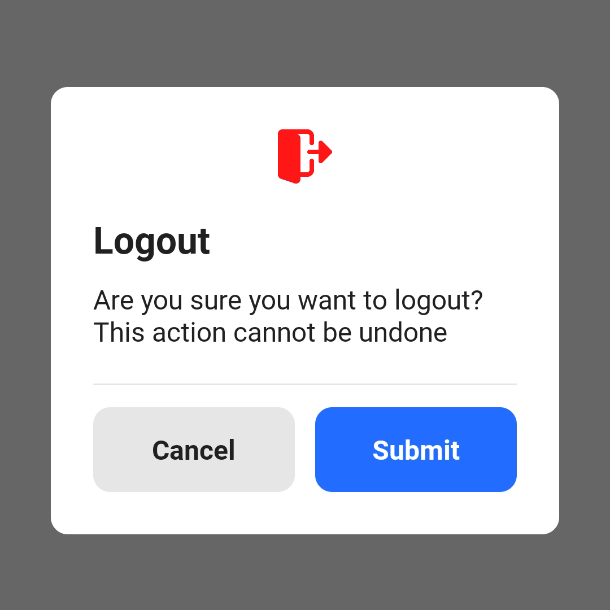
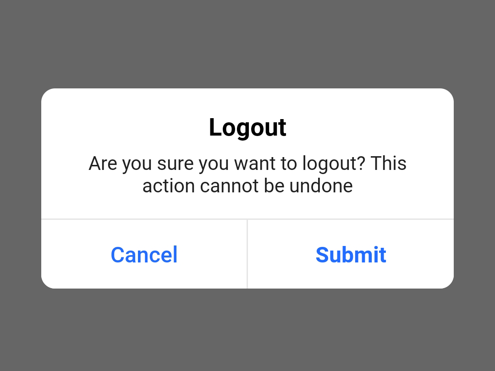
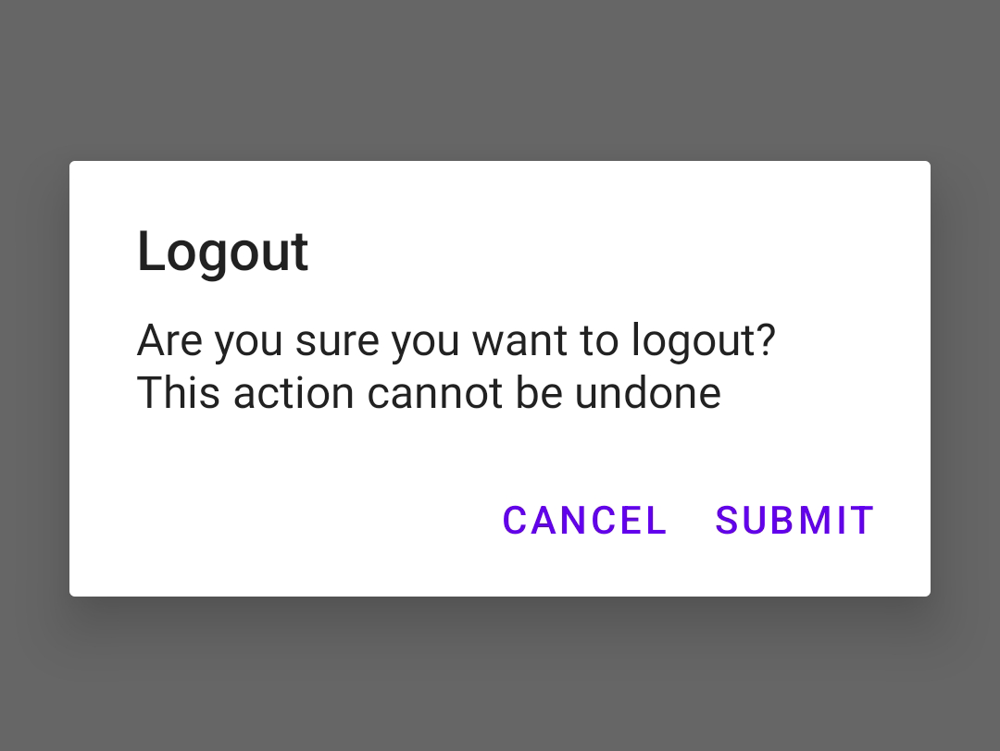

[](https://search.maven.org/search?q=g:%22com.saadahmedev.popup-dialog%22%20AND%20a:%22popup-dialog%22)
[](https://opensource.org/licenses/Apache-2.0)
<a href="https://android-arsenal.com/api?level=21"></a>
<a href="https://github.com/saadahmedscse/shortintent"></a>
<a href="https://github.com/saadahmedscse/shortintent/graphs/traffic"></a>
<a href="[https://github.com/rrsaikat/CodeChallengeByShikho/graphs/traffic](https://github.com/saadahmedscse/shortintent/graphs/traffic)"></a>

# Android Popup Dialog
Getting tired by writing and coding default progress bar and custom popup dialog? Android Popup Dialog is a lightweight and easy to use Android library that provides you to make many kinds of dialog [Popup and Progress] by writing just some lines code. You don't have to design manually. You can customize every dialog and every properties of it's manually.
* Min SDK 21 (Android Kitkat 5.0)
* Written in Java
* Compatible for both Java and Kotlin

## Features
* Default circular progress bar dialog
* Android default alert dialog
* IOS default popup dialog
* Stylish standard dialog
* Progress dialog with lottie animation
* Success dialog
* Alert dialog
* Failed dialog

## Installation

Add the dependency to your module build.gradle:
```groovy
dependencies {
    ...
    implementation 'com.saadahmedev.popup-dialog:popup-dialog:1.0.2'
}
```

## Usage
### Styles :
`Styles.PROGRESS`  
`Styles.IOS`  
`Styles.ANDROID_DEFAULT`  
`Styles.STANDARD`  
`Styles.LOTTIE_ANIMATION`  
`Styles.SUCCESS`  
`Styles.FAILED`  
`Styles.ALERT`  

### Implementation :
<table>
<tr>
<th> PROGRESS </th>
<th> Result </th>
</tr>
<tr>
<td>

```java
PopupDialog.getInstance(this)
    .setStyle(Styles.PROGRESS)
    .setProgressDialogTint(R.color.color_red)
    .setCancelable(false)
    .showDialog();
```

</td>
<td>


</td>
</tr>
</table>

<table>
<tr>
<th> LOTTIE_ANIMATION </th>
<th> Result </th>
</tr>
<tr>
<td>

```java
PopupDialog.getInstance(this)
    .setStyle(Styles.LOTTIE_ANIMATION)
    //Required if no RawRes
    .setLottieAssetName("technologies.json")
    //Required if no Asset
    .setLottieRawRes(R.raw.technologies)
    .setCancelable(false)
    .showDialog();
```

</td>
<td>


</td>
</tr>
</table>

<table>
<tr>
<th> STANDARD </th>
<th> Result </th>
</tr>
<tr>
<td>

```java
PopupDialog.getInstance(this)
    .setStyle(Styles.STANDARD)
    .setHeading("Logout")
    .setHeading("Are you sure you want to logout?"+
        " This action cannot be undone")
    .setPopupDialogIcon(R.drawable.ic_logout)
    .setPopupDialogIconTint(R.color.color_red)
    .setCancelable(false)
    .showDialog(new OnDialogButtonClickListener() {
        @Override
        public void onPositiveClicked(Dialog dialog) {
            super.onPositiveClicked(dialog);
        }

        @Override
        public void onNegativeClicked(Dialog dialog) {
            super.onNegativeClicked(dialog);
        }
    });
```

</td>
<td>



</td>
</tr>
</table>

<table>
<tr>
<th> IOS </th>
<th> Result </th>
</tr>
<tr>
<td>

```java
PopupDialog.getInstance(this)
    .setStyle(Styles.IOS)
    .setHeading("Logout")
    .setHeading("Are you sure you want to logout?"+
        " This action cannot be undone")
    .setCancelable(false)
    .showDialog(new OnDialogButtonClickListener() {
        @Override
        public void onPositiveClicked(Dialog dialog) {
            super.onPositiveClicked(dialog);
        }

        @Override
        public void onNegativeClicked(Dialog dialog) {
            super.onNegativeClicked(dialog);
        }
    });
```

</td>
<td>



</td>
</tr>
</table>

<table>
<tr>
<th> ANDROID_DEFAULT </th>
<th> Result </th>
</tr>
<tr>
<td>

```java
PopupDialog.getInstance(this)
    .setStyle(Styles.ANDROID_DEFAULT)
    .setHeading("Logout")
    .setHeading("Are you sure you want to logout?"+
        " This action cannot be undone")
    .setCancelable(false)
    .showDialog(new OnDialogButtonClickListener() {
        @Override
        public void onPositiveClicked(Dialog dialog) {
            super.onPositiveClicked(dialog);
        }

        @Override
        public void onNegativeClicked(Dialog dialog) {
            super.onNegativeClicked(dialog);
        }
    });
```

</td>
<td>



</td>
</tr>
</table>

<table>
<tr>
<th> SUCCESS </th>
<th> Result </th>
</tr>
<tr>
<td>

```java
PopupDialog.getInstance(this)
    .setStyle(Styles.SUCCESS)
    .setHeading("Well Done")
    .setHeading("You have successfully"+
        " completed the task")
    .setCancelable(false)
    .showDialog(new OnDialogButtonClickListener() {
        @Override
        public void onDismissClicked(Dialog dialog) {
            super.onDismissClicked(dialog);
        }
    });
```

</td>
<td>


</td>
</tr>
</table>

<table>
<tr>
<th> ALERT </th>
<th> Result </th>
</tr>
<tr>
<td>

```java
PopupDialog.getInstance(this)
    .setStyle(Styles.ALERT)
    .setHeading("Pending")
    .setHeading("You verification is under"+
        " observation. Try again later.")
    .setCancelable(false)
    .showDialog(new OnDialogButtonClickListener() {
        @Override
        public void onDismissClicked(Dialog dialog) {
            super.onDismissClicked(dialog);
        }
    });
```

</td>
<td>


</td>
</tr>
</table>

<table>
<tr>
<th> FAILED </th>
<th> Result </th>
</tr>
<tr>
<td>

```java
PopupDialog.getInstance(this)
    .setStyle(Styles.FAILED)
    .setHeading("Uh-Oh")
    .setHeading("Unexpected error occurred."+
        " Try again later.")
    .setCancelable(false)
    .showDialog(new OnDialogButtonClickListener() {
        @Override
        public void onDismissClicked(Dialog dialog) {
            super.onDismissClicked(dialog);
        }
    });
```

</td>
<td>


</td>
</tr>
</table>

All Properties [REQUIRED & NON-REQUIRED]
----------------------------------------
<table>
<tr>
<th width="1200px"> REQUIRED & NON-REQUIRED PROPERTIES </th>
</tr>
<tr>
<td>

```java
//Let Dialog types with A, B and C
//---Dialog Type A--->[PROGRESS, LOTTIE_ANIMATION]
//---Dialog Type B--->[IOS, ANDROID_DEFAULT, STANDARD]
//---Dialog Type C--->[SUCCESS, FAILED, ALERT]

//Created object for later usage to dismiss the dialog
PopupDialog dialog = PopupDialog.getInstance(this); //Context is required for creating instance

dialog.setStyle(Styles.SUCCESS) //Required for Dialog Type [A, B, C]

    //-----------------------------HEADING-DESCRIPTION-----------------------------//
    .setHeading("Well Done") //Required for only [B, C]
    .setDescription("You have successfully completed the task") //Required only for [B, C]
    .setHeadingTextColor(R.color.black) //Non-Required. Work only for [B, C]
    .setDescriptionTextColor(R.color.grey) //Non-Required. Work only for [B, C]

    //-----------------------------ICON & TINT-----------------------------//
    .setPopupDialogIcon(R.drawable.ic_logout) //Non-Required. Work only for [B]
    .setPopupDialogIconTint(R.color.red) //Non-Required. Work only for [B]
    .setProgressDialogTint(R.color.green) //Non-Required. Work only for [PROGRESS]

    //-----------------------------TIMEOUT-----------------------------//
    .setTimeout(1) //Non-Required. Work only for [A, B, C] excluding [LOTTIE_ANIMATION]
    .setLottieDialogTimeout(5) //Non-Required. Work only for [LOTTIE_ANIMATION]

    //-----------------------------CANCELABLE-----------------------------//
    .setCancelable(false) //Non-Required. Work only for [A, B, C]

    //-----------------------------DIALOG ACTION BUTTON TEXT-----------------------------//
    .setPositiveButtonText("Confirm") //Non-Required. Work only for [B]
    .setNegativeButtonText("Deny") //Non-Required. Work only for [B]
    .setDismissButtonText("Close") //Non-Required. Work only for [C]

    //-----------------------------DIALOG ACTION BUTTON TEXT COLOR-----------------------------//
    .setPositiveButtonTextColor(R.color.blue) //Non-Required. Work only for [B]
    .setNegativeButtonTextColor(R.color.red) //Non-Required. Work only for [B]
    .setDismissButtonTextColor(R.color.green)//Non-Required. Work only for [C]

    //-----------------------------DIALOG ACTION BUTTON BACKGROUND-----------------------------//
    .setPositiveButtonBackground(R.drawable.bg_yellow) //Non-Required. Work only for [B]
    .setNegativeButtonBackground(R.drawable.bg_light_grey) //Non-Required. Work only for [B]
    .setDismissButtonBackground(R.drawable.bg_black) //Non-Required. Work only for [C]

    //-----------------------------LOTTIE ANIMATION LINKING-----------------------------//
    .setLottieRawRes(R.raw.technologies) //Required if not Asset. Work only for [LOTTIE_ANIMATION]
    .setLottieAssetName("technologies.json") //Required if no RawRes. Work only for [LOTTIE_ANIMATION]
    .setLottieDialogTimeout(5) //Non-Required. Work only for [LOTTIE_ANIMATION] Unit: Second
    .setLottieAnimationSpeed(5F) //Non-Required. Work only for [LOTTIE_ANIMATION] Unit: Float
    .setLottieRepeatCount(500) //Non-Required. Work only for [LOTTIE_ANIMATION] Unit: Int

    .showDialog() //Required. Work only for [A]

    .showDialog(new OnDialogButtonClickListener() { //Required. Work only for [B, C]
        @Override
        public void onPositiveClicked(Dialog dialog) { //Non-Required. Work only for [B]
            /*
             Calling super keyword will dismiss the dialog
             Don't call super keyword if not needed
            */
            super.onPositiveClicked(dialog);
        }

        @Override
        public void onNegativeClicked(Dialog dialog) { //Non-Required. Work only for [B]
            /*
             Calling super keyword will dismiss the dialog
             Don't call super keyword if not needed
            */
            super.onNegativeClicked(dialog);
        }

        @Override
            public void onDismissClicked(Dialog dialog) { //Non-Required. Work only for [C]
                /*
                 Calling super keyword will dismiss the dialog
                 Don't call super keyword if not needed
                */
                super.onDismissClicked(dialog);
            }
        });
```

</td>
</tr>
</table>

Changelog
---------
* **1.0.1**
  * Set positive and negative button text programmatically
* **1.0.0**
    * Initial release

License
-------
```
Copyright 2022 Saad Ahmed

Licensed under the Apache License, Version 2.0 (the "License");
you may not use this file except in compliance with the License.
You may obtain a copy of the License at

    http://www.apache.org/licenses/LICENSE-2.0

Unless required by applicable law or agreed to in writing, software
distributed under the License is distributed on an "AS IS" BASIS,
WITHOUT WARRANTIES OR CONDITIONS OF ANY KIND, either express or implied.
See the License for the specific language governing permissions and
limitations under the License.
```
